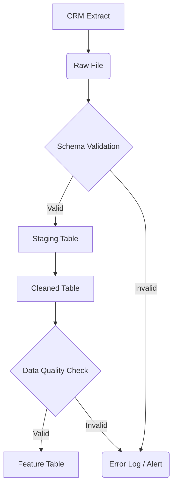

# CoWork Project - Customer Data Pipeline Architecture

**Date:** 2026-08-14
**Status:** Design Document
**Project Phase:** Phase 5 (Future Development & Orchestration)

---

## 1. Pipeline Overview

This document outlines the architecture for the CoWork customer data pipeline, from raw CRM extracts to ML scoring and API/Dashboard consumption. The pipeline is designed for incremental processing, robust data quality assurance, and integration with existing project phases.

---

## 2. Pipeline Layers & Components

This table maps each pipeline layer to its data format, primary tools, next consumers, and the corresponding CoWork project components (or conceptual "labs" as per the prompt).

| Layer                      | Data Format         | Primary Tool(s)                                 | Next Reader(s)              | CoWork Project Mapping (Conceptual Lab / Component) |
| :------------------------- | :------------------ | :---------------------------------------------- | :-------------------------- | :-------------------------------------------------- |
| **1. CRM Extract**   | CSV                 | CRM System Export Utility                       | Raw File Storage            | (External Source)                                   |
| **2. Raw File**      | CSV (Untouched)     | Local Filesystem (`d:\CoWork\data\`)          | Staging Ingestion Process   | **CP5** (Initial Data Acquisition)            |
| **3. Staging Table** | MySQL Table         | Python (`datainsertion.py`) + SQLAlchemy      | Data Cleaning Process       | **DE2** (Formalized Ingestion)                |
| **4. Cleaned Table** | MySQL Tables        | Python (`datainsertion.py`) + SQLAlchemy      | Feature Engineering Process | **DE3** (Formalized Cleaning)                 |
| **5. Feature Table** | MySQL Tables        | Python (`datainsertion.py`) + SQLAlchemy      | ML Scoring, Dashboard/API   | **DE3** (Feature Engineering)                 |
| **6. ML Scoring**    | API Response (JSON) | FastAPI (`main.py`) + Python ML Model         | Dashboard/API               | **Phase 3 API Layer** (ML Integration)        |
| **7. Dashboard/API** | JSON / Visuals      | FastAPI (`main.py`) + BI Tool (e.g., Grafana) | End-users, Other Systems    | **Phase 3 API Layer** (API Exposure)          |

*Note: "CP5", "DE2", "DE3" are interpreted as conceptual project phases or teams responsible for these stages. They map to the physical `PhaseX` directories and files as detailed below.*

---

## 3. Key Quality Gates

### 3.1. Schema Validation (Before Staging Load)

* **Purpose:** Ensure incoming raw data conforms to the expected structure before loading into the database. This prevents data type mismatches, missing critical columns, or unexpected formats that could break downstream processes.
* **Location:** Between "Raw File" and "Staging Table" (executed before `Phase2/datainsertion.py` begins processing a new CSV).
* **Mechanism:**
  * **CSV Header Check:** Verify column names and their order match the predefined schema.
  * **Data Type Validation:** Sample data or use predefined rules to check if column values can be reliably cast to target database types (e.g., `age` is an integer, `estimated_salary` is a float).
  * **Basic Constraint Check:** Ensure non-nullable fields are present and not empty.
* **Action on Failure:** Reject the entire batch or flag problematic rows for manual review. Log errors to `data_insertion.log` and trigger immediate alerts to data engineering team.

### 3.2. Data Quality Check (Before Feature Build)

* **Purpose:** Validate the integrity, consistency, and completeness of data after initial cleaning, but before complex feature engineering or model training. This ensures that features are built on reliable and meaningful data.
* **Location:** Between "Cleaned Table" and "Feature Table" (executed after `Phase2/datainsertion.py` has loaded data into the cleaned tables, but before `risk_score` calculation or other advanced feature generation).
* **Mechanism:**
  * **Completeness:** Check for missing values in critical columns (e.g., `customer_id`, `gender`, `age`).
  * **Consistency:** Validate categorical values against allowed lists (e.g., `gender` is 'Male' or 'Female'), check for logical inconsistencies (e.g., `age` > 100 or `age` < 18 if not allowed).
  * **Uniqueness:** Verify uniqueness constraints on primary keys (e.g., `customer_id`).
  * **Referential Integrity:** Ensure foreign key relationships are valid (e.g., `telecom_partner_id` exists in `telecom_partner` table).
  * **Outlier Detection:** Basic statistical checks for extreme values (e.g., `estimated_salary` unusually high/low, `tenure` negative).
* **Action on Failure:** Flag individual records as "unqualified" (e.g., add a `data_quality_status` column to the `customers` table), quarantine them in a separate error table, or prevent feature generation for affected records. Generate detailed data quality reports.

---

## 4. Incremental Processing Strategy

**Question:** What happens when the same customer appears in two consecutive daily extracts?

**Strategy: Upsert (Update or Insert) based on `customer_id`**

1. **Identification:** Each customer record is uniquely identified by `customer_id`. This field serves as the primary key in the `customers` table.
2. **Processing Logic (within `Phase2/datainsertion.py`):**
   * When processing a new batch of customer data from a raw extract, for each customer record that passes schema validation:
     * The system will attempt to find an existing record in the `customers` table using its `customer_id`.
     * **If Found:** The existing customer's attributes (e.g., `gender`, `age`, `date_of_registration`, `tenure`, `num_dependents`, `estimated_salary`, `churn`, `calls_made`, `sms_sent`, `data_used`) will be updated. A `last_updated_at` timestamp column should be added to the `customers` and `customer_usage` tables and automatically updated on every change.
     * **If Not Found:** The new customer record will be inserted into the `customers` and `customer_usage` tables.
   * This ensures that customer data is always up-to-date without creating duplicate entries and maintains a single source of truth for each customer.
3. **Risk Score Recalculation:** Upon any update to a customer's `tenure`, `usage` metrics, or `estimated_salary`, the `risk_score` and `risk_category` must be re-calculated and updated in the `customers` table to reflect the most current customer behavior. This is already integrated into `Phase2/datainsertion.py` during the insertion/update process.
4. **Database Mechanism:** This upsert logic can be efficiently implemented using SQLAlchemy's `merge()` operation or by executing `INSERT ... ON DUPLICATE KEY UPDATE` SQL statements directly in MySQL.

---

## 5. CoWork Project Phase Implementation Mapping

This section details how the pipeline layers are implemented across the existing CoWork project phases.

* **Phase 1 (Data Exploration & Analysis):**

  * **Contribution:** Initial understanding of "Raw File" data, development of preliminary cleaning rules, and feature ideas.
  * **Files:** `Phase1/*.ipynb` (data profiling), `Phase1/preprocess.py`, `telecom_preprocessing.py` (prototype cleaning scripts).
* **Phase 2 (Data Ingestion Layer):**

  * **Contribution:** Core implementation of "Raw File" reading, "Staging Table" processing (in-memory deduplication, foreign key enrichment), loading into "Cleaned Table" (Customers, TelecomPartner, Locations, CustomerUsage), and initial "Feature Table" generation (`risk_score`, `risk_category`).
  * **Files:**
    * `Phase2/datainsertion.py`: Reads `telecom_churn.csv`, performs parent deduplication, enriches data, and inserts/updates records into the database, including `risk_score` calculation. This script needs enhancements for explicit schema validation and robust upsert logic.
    * `Phase2/database.py`: Defines the SQLAlchemy ORM models for all core tables (`telecom_partner`, `locations`, `customers`, `customer_usage`), including the `risk_score` and `risk_category` columns.
* **Phase 3 (API/Query Layer):**

  * **Contribution:** Exposes the "Feature Table" data via REST API, including "ML Scoring" and "Dashboard/API" endpoints.
  * **Files:**
    * `Phase3/main.py`: FastAPI application, defines API endpoints (`/customers/{id}`, `/churn/summary`, `/customers/risk-analysis/high-risk`, `/ml/predict-churn`).
    * `Phase3/rules.py`: Contains the business logic for querying the "Feature Table" and preparing data for API responses.
    * `Phase3/schemas.py`: Defines Pydantic models for API request validation and response serialization.
    * `Phase3/auth.py`: Handles authentication for API access.
* **Phase 5 (Pipeline Orchestration & Monitoring - Future):**

  * **Contribution:** This phase will focus on implementing robust orchestration (e.g., using Apache Airflow or Prefect) to manage the execution of `datainsertion.py` and other pipeline components, integrate comprehensive monitoring, and enhance error handling across all layers. This architecture document serves as a foundational design for this phase.
